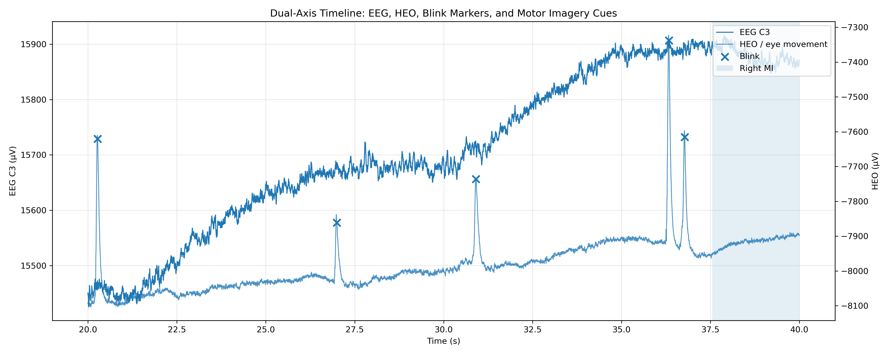
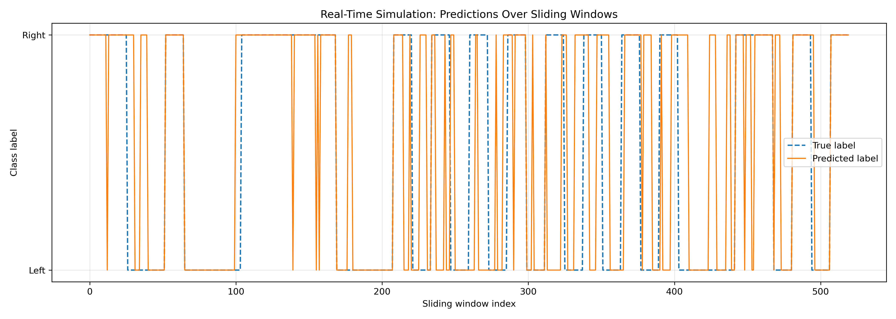
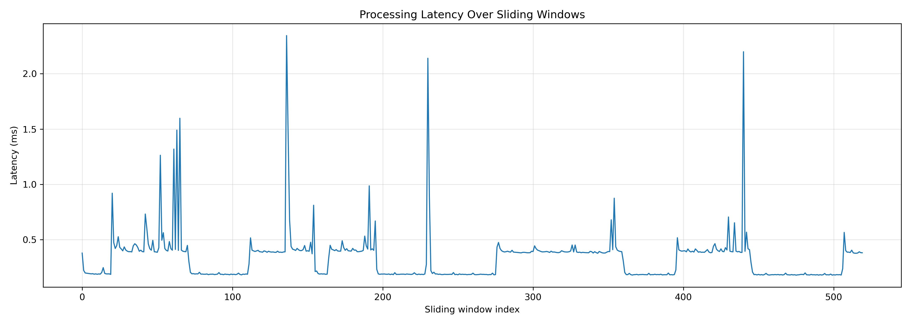

# Multimodal BCI: Real-Time Motor Imagery Decoding with EEG & Blink Analysis

This project implements a **real-time Brain-Computer Interface (BCI) pipeline** using EEG data, integrating:

- Motor Imagery (MI) decoding
- Eye-blink (EOG) artefact analysis
- CSP-based feature extraction
- Sliding-window real-time simulation

---

## Key Features

- EEG + EOG multimodal processing
- Motor imagery classification (Left vs Right)
- Real-time sliding window decoding
- Common Spatial Pattern (CSP) feature extraction
- Latency benchmarking
- Blink artefact impact analysis

---

## Results

### Offline Performance
- CSP Accuracy: **73.7%**
- Balanced precision/recall across classes

---

### Real-Time Simulation
- Accuracy: **75.4%**
- Mean latency: **0.33 ms**
- Max latency: **2.34 ms**

✔️ Demonstrates real-time feasibility

---

### Artefact Impact

| Dataset        | Accuracy |
|---------------|--------|
| All epochs    | 41.7% |
| Clean epochs  | 62.5% |

Eye blinks significantly degrade classification performance.

---

## Visualisations

### EEG + HEO + Blink Timeline
- Dual-axis plot showing:
  - EEG (C3)
  - Eye movement (HEO)
  - Blink markers
  - Motor imagery cues
 

### Real-Time Predictions
- Sliding-window predictions vs ground truth
 

### Latency Analysis
- Processing time per window (sub-millisecond performance)
 

---

## 🏗️ Pipeline Overview
